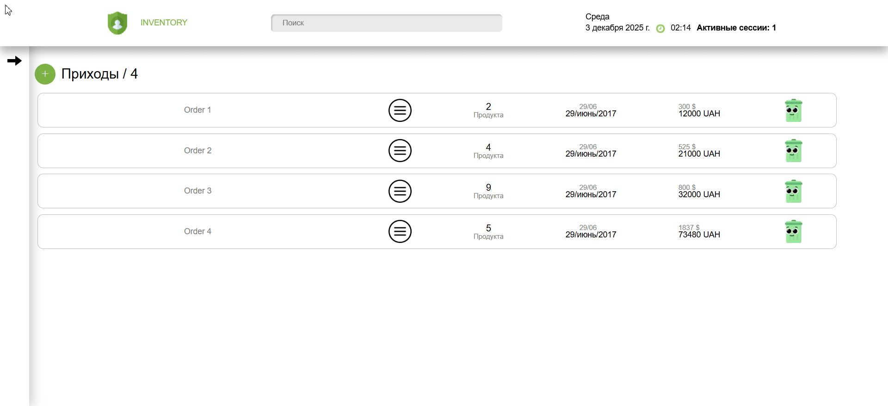

## DZENcode Test Task — Product Manager App

- Веб-приложение для управления группами товаров (Orders) и единицами товара (Product Items).
- Реализована api логика, фильтрация и интеграция с Firebase Realtime Database.

---

### Update Log

#### 29.11.2025 — API & Database

- Перевод асинхронной логики на Redux Thunk.
- Полные CRUD-операции для Orders и Products.
- Интеграция с Firebase Realtime Database (создание, обновление, удаление).
- Валидация входящих данных через Zod.
- Добавлен компонент ActiveSessionsCounter — счётчик активных сессий.

---

#### 25.11.2025 — Cleaning & Refactoring

- Глубокий рефакторинг фронтенда.
- Вынесение логики в кастомные хуки.
- Созданы отдельные popup-компоненты: <CreateOrderPopup/> <CreateProductPopup/>

---

### Стек

- TypeScript
- Next.js
- Redux Toolkit
- SCSS
- Firebase Realtime Database
- Zod

---

### Функционал приложения

- Приложение отображает список групп товаров (Orders) и товары (Product Items) внутри них.
- Пользователь может:
- создавать / удалять группы `order`;
- добавлять / удалять товары `product`;
- просматривать детали группы;
- фильтровать товары по типу и спецификации;
- видеть цену в USD и UAH;
- видеть даты создания / гарантии.

---

### Структура приложения

#### Страницы:

- index.tsx — список групп товаров `Orders` + `component popup` создания `Order`.
- [id].tsx — товары внутри выбранного `Order` + фильтрация + `component popup` создания `Product Item`.

#### Компоненты:

- <Header/> — логотип, дата, время.
- <NavMenu/> — боковое меню.
- <Order/> — карточка группы товаров.
- <ProductItem/> — карточка товара.

- <AppLoader/> — отображает состояние загрузки приложения (“loading…”).
- <Wrapper/> — общая обёртка макета.

- <ActiveSessionsCounter/> — отображает текущее количество активных сессий приложения (получает данные в реальном времени из Firebase).
- <CreateOrderPopup/> — popup для создания новой группы товаров `Order`.
- <CreateProductPopup/> — popup для создания товара внутри выбранной группы `ProductItem`.
- <DeleteButton/> — кнопка удаления `Order` или `Product`

---

### State Management

- Redux `/storage/mainReducer.ts`

---

### Data base scheme

- Можно найти в корне проекта, файл:`assets/databaseSchema.json`.

---

### Docker

- Архив доступен по ссылки: [google disk](https://drive.google.com/file/d/15VVk51BaAWAaZ5v8sG6JTaVk0IXrrLGZ/view?usp=sharing)

---

## Деплой : [https://d-ze-ncode-tz.vercel.app/](https://d-ze-ncode-tz.vercel.app/)

### запуск проекта

Если вы хотите локально запустить на своём компьютере, вам нужно скачать файлы, включаю `package.json`, прописать в консоль `npm i`, подождать установки всех зависимостей, затем прописать в консоль `npm run dev`

---

### Demo

